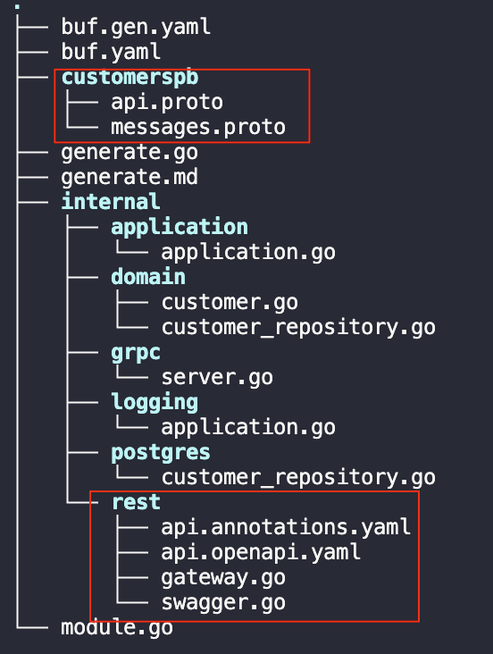
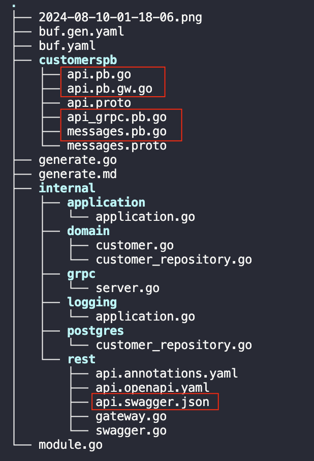

1. brew install bufbuild/buf/buf
```
sudo GO111MODULE=on GOBIN=/usr/local/bin go install \
github.com/bufbuild/buf/cmd/buf@v1.36.0
```


"github.com/grpc-ecosystem/grpc-gateway/v2/protoc-gen-grpc-gateway"
"github.com/grpc-ecosystem/grpc-gateway/v2/protoc-gen-openapiv2"
"google.golang.org/grpc/cmd/protoc-gen-go-grpc"
"google.golang.org/protobuf/cmd/protoc-gen-go"

参考 tools.go 里面的安装方式

1. 学习 buf 用法使用：git clone git@github.com:bufbuild/buf-tour.git
2. cd buf-tour/start/getting-started-with-buf-cli
3. buf config init
生成的 buf.yaml 文件就像一个工作区，其中只有一个模块，其路径设置为当前目录。要在工作区中明确定义模块，请提供包含 .proto 文件的目录路径。使用 modules 关键字将 proto 目录添加到 buf.yaml 文件中：
```yaml
version: v2
+modules:
+  - path: proto
lint:
  use:
    - DEFAULT
breaking:
  use:
    - FILE
```
本文 customers 中使用的 buf 模版为
```yaml
version: v1
lint:
  enum_zero_value_suffix: _UNKNOWN
  except:
    - PACKAGE_VERSION_SUFFIX
    - PACKAGE_DIRECTORY_MATCH
breaking:
  use:
    - FILE
```
模块配置完成后，我们将创建一个 buf.gen.yaml 文件来配置本地代码生成。它控制着 buf 生成命令如何在给定模块上执行 protoc 插件。你可以用它来配置每个 protoc 插件写入结果的位置，并为每个插件指定选项。
1. touch buf.gen.yaml
2. Configure a buf.gen.yaml file
```yaml
version: v2
managed:
  enabled: true
  override:
    - file_option: go_package_prefix
      value: github.com/bufbuild/buf-tour/gen
plugins:
  - remote: buf.build/protocolbuffers/go
    out: gen
    opt: paths=source_relative
  - remote: buf.build/connectrpc/go
    out: gen
    opt: paths=source_relative
inputs:
  - directory: proto
```
它执行 protocolbuffers/go 插件，为 .proto 文件生成 Go 专用代码，并将其输出放到 gen 目录中。
它会执行 connectrpc/go 插件，在 gen 目录中生成 Connect-Go 的客户端和服务器存根。
这种配置有几点需要注意：
- Managed mode: 托管模式是一个配置选项，它告诉 Buf CLI 根据一套适合每种支持的 Protobuf 语言的意见值来设置工作区中的所有文件选项。长期以来，文件选项一直是 Protobuf 用户感到困惑和沮丧的根源，因此托管模式会根据配置临时设置这些选项，允许你从 .proto 文件中删除它们。
- remote mode: 此处指定的插件是托管在 Buf 模式注册中心的远程插件。使用这些插件，就无需在本地计算机上下载、维护或运行插件。
- Inputs: buf 生成命令可以接受多种类型的输入，如 Buf 模块、GitHub 资源库和 tarball/zip 压缩包。示例代码指向工作区中的 proto 子目录。
现在您已经配置了 buf.gen.yaml 文件，可以生成与 PetStoreService API 相关的 Connect RPC 和 Go 代码。运行此命令：
1. buf generate
如果成功，你会发现 gen 目录中有几个新文件，它们就是生成的代码存根：
```
getting-started-with-buf-cli
├── buf.gen.yaml
├── buf.yaml
├── gen
│   ├── google
│   │   └── type
│   │       └── datetime.pb.go
│   └── pet
│       └── v1
│           ├── pet.pb.go
│           └── petv1connect
│               └── pet.connect.go
└── proto
    ├── google
    │   └── type
    │       └── datetime.proto
    └── pet
        └── v1
            └── pet.proto
```
1. Lint your API. 虽然 Buf CLI 是 protoc 的理想替代品，但它远不止是一个 Protobuf 编译器。它还通过 buf lint 命令提供了校验功能。当你运行 buf lint 命令时，它会根据指定的 lint 规则检查 buf.yaml 文件中列出的所有模块。运行此命令可检查导览工作区中的所有 .proto 文件是否存在 lint 错误：
- buf lint
```
proto/google/type/datetime.proto:17:1:Package name "google.type" should be suffixed with a correctly formed version, such as "google.type.v1".
proto/pet/v1/pet.proto:42:10:Field name "petID" should be lower_snake_case, such as "pet_id".
proto/pet/v1/pet.proto:47:9:Service name "PetStore" should be suffixed with "Service".
```
首先修复 pet/v1/pet.proto 文件中的 lint 故障，这些故障源于 FIELD_LOWER_SNAKE_CASE 和 SERVICE_SUFFIX 规则。结果会准确指出要修复错误需要更改的内容，因此请更新 pet.proto 文件：
```
syntax = "proto3";

package pet.v1;

...

message DeletePetRequest {

-  string petID = 1;

+  string pet_id = 1;

}

message DeletePetResponse {}


-service PetStore {

+service PetStoreService {

  rpc GetPet(GetPetRequest) returns (GetPetResponse) {}
  rpc PutPet(PutPetRequest) returns (PutPetResponse) {}
  rpc DeletePet(DeletePetRequest) returns (DeletePetResponse) {}
}
```
google/type/datetime.proto 实际上并不是本地项目中的一个文件。相反，它是你的依赖项之一，由 googleapis 提供，因此你无法通过更改它的软件包声明来修复 lint 故障。相反，你可以通过更改配置来告诉 Buf CLI 忽略 google/type/datetime.proto 文件：
```yaml
version: v2
modules:
  - path: proto
lint:
  use:
    - DEFAULT
+  ignore:
+    - proto/google/type/datetime.proto
breaking:
  use:
    - FILE
```

9. Implement the server
```go
package main

import (
  "context"
  "fmt"
  "log"
  "net/http"
  petv1 "github.com/bufbuild/buf-tour/gen/pet/v1"
  "github.com/bufbuild/buf-tour/gen/pet/v1/petv1connect"
  connect "connectrpc.com/connect"
  "golang.org/x/net/http2"
  "golang.org/x/net/http2/h2c"
)

const address = "localhost:8080"

func main() {
  mux := http.NewServeMux()
  path, handler := petv1connect.NewPetStoreServiceHandler(&petStoreServiceServer{})
  mux.Handle(path, handler)
  fmt.Println("... Listening on", address)
  http.ListenAndServe(
    address,
    // Use h2c so we can serve HTTP/2 without TLS.
    h2c.NewHandler(mux, &http2.Server{}),
  )
}

// petStoreServiceServer implements the PetStoreService API.
type petStoreServiceServer struct {
  petv1connect.UnimplementedPetStoreServiceHandler
}

// PutPet adds the pet associated with the given request into the PetStore.
func (s *petStoreServiceServer) PutPet(
  ctx context.Context,
  req *connect.Request[petv1.PutPetRequest],
) (*connect.Response[petv1.PutPetResponse], error) {
  name := req.Msg.GetName()
  petType := req.Msg.GetPetType()
  log.Printf("Got a request to create a %v named %s", petType, name)
  return connect.NewResponse(&petv1.PutPetResponse{}), nil
}
```

10. go run server/main.go
11. 测试服务

buf curl \
  --schema . \
  --data '{"pet_type": "PET_TYPE_SNAKE", "name": "Ekans"}' \
  http://localhost:8080/pet.v1.PetStoreService/PutPet

2024/04/23 14:23:35 Got a request to create a PET_TYPE_SNAKE named Ekans


# 生成文件对比


